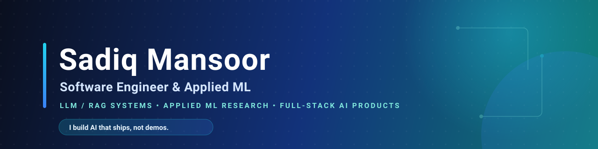

  

  
  
  
  

  

---

## Profile

I build applied AI systems end-to-end — from data and research design through to models, APIs, and
deployed products. My work spans LLM/RAG pipelines, applied ML for signal classification and clinical
prediction, and the full-stack interfaces that make model outputs actually usable.

I'm strongest where research has to become software: turning experiments into reproducible pipelines,
exposing models through practical FastAPI apps, and documenting projects so another engineer can run,
inspect, and extend them.

<table>
  <tr>
    <td width="33%" valign="top">
      <strong>LLM &amp; Applied ML</strong> 
      RAG pipelines, prompt engineering, cited answers, classification, regularisation &amp; generalisation studies, imbalanced learning, formal evaluation.
    </td>
    <td width="33%" valign="top">
      <strong>Product Engineering</strong> 
      Python, React, FastAPI, Streamlit, REST APIs, auth, dashboards, and user-facing AI workflows deployed on Azure &amp; Vercel.
    </td>
    <td width="33%" valign="top">
      <strong>Engineering Discipline</strong> 
      Clear READMEs, reproducible setup, honest metrics, safe secret handling, and pragmatic, deployable architecture.
    </td>
  </tr>
</table>

---

## Selected Work

<em>Every project below is live — click a demo to try it.</em>

<table>
  <tr>
    <td width="50%" valign="top">
      <h3><a href="https://linkintelligence.sadiqmansoor.tech/">LinkIntelligence</a></h3>
      
<strong>Turn any website into a private, source-backed AI expert.</strong>

      
Crawl a site → index it as vectors → chat with answers that cite their sources. End-to-end RAG behind a clean FastAPI service.

      

        
        
        
        
      

    </td>
    <td width="50%" valign="top">
      <h3><a href="https://eeg-classification.sadiqmansoor.tech/">EEG State Classification</a></h3>
      
<strong>Reproducible ML study across real EEG datasets.</strong>

      
How preprocessing order &amp; regularisation jointly affect generalisation on imbalanced EEG — 3 benchmarks, 5 hypotheses tested for statistical significance. <a href="https://github.com/sadiq-mansoor/ML_project">Code →</a>

      

        
        
        
        
      

    </td>
  </tr>
  <tr>
    <td width="50%" valign="top">
      <h3><a href="https://provenance.sadiqmansoor.tech/">Provenance</a></h3>
      
<strong>Media-literacy platform for spotting AI-generated content.</strong>

      
Interactive learning around C2PA metadata, provenance chains, and deepfake detection — making AI-detection skills accessible.

      

        
        
        
        
      

    </td>
    <td width="50%" valign="top">
      <h3><a href="https://cybersafe-pk.sadiqmansoor.tech/">CyberSafe PK</a></h3>
      
<strong>Modern cybercrime-reporting cell for Pakistan.</strong> <em>(collab)</em>

      
React + FastAPI prototype for citizens to report incidents and track cases, with local ML tools for flagging AI-generated media.

      

        
        
        
        
      

    </td>
  </tr>
</table>

---

## Research

- **Under review (2026)** — *Isolating an interpretable, length- &amp; code-controlled linguistic signal in LLM prompt-injection and jailbreak corpora.* (methodology to follow post-publication)
- **Applied study** — Chronic Kidney Disease risk prediction with a leakage-safe scikit-learn pipeline on the UCI dataset, served via FastAPI.

---

## Technical Stack

  
  
  
  
  
  
  
  
  
  
  
  
  

---

## What I Optimize For

| Area | What I care about |
| --- | --- |
| Reproducibility | Documented data sources, dependency files, and experiments another engineer can rerun from scratch. |
| Model credibility | Honest metrics, validation boundaries, baseline comparisons, and clearly stated failure modes. |
| Product usability | Interfaces that expose model behavior clearly instead of hiding it inside notebooks. |
| Repository quality | Clean READMEs, safe secret handling, sensible structure, and focused, deployable projects. |

---

## GitHub Snapshot

  
  

  

---

## Current Focus

- Shipping deployable AI products (LLM/RAG, media forensics) rather than notebook-only experiments.
- Publishing my LLM prompt-injection research and strengthening reproducibility across repos.
- Building honest, well-documented ML — clear metrics, validation boundaries, and clean setup.
- Open to **freelance AI/ML work, software-engineering roles, and research collaboration.**

  

